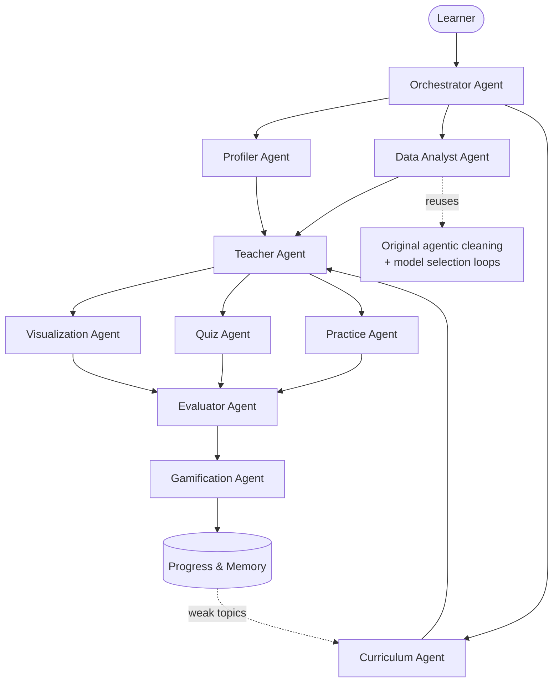

# Personalized Data Science Tutor

A multi-agent AI tutor that teaches a non-data-scientist exactly the data
science their job needs -- using their own dataset, at their own level, toward
their own goal.

Built on top of an agentic data cleaning and modeling engine that checks its
own work and backtracks when a fix distorts the data.

---

## 1. Problem statement

> **How might we help non-data-science professionals understand and utilize
> data science efficiently, in a simple, less complex, fun and personalized
> way?**

Sales, marketing, HR, operations and finance professionals -- and students and
complete beginners -- have real data they want to understand. Their options
today are two extremes: a general data science course built on textbook
datasets that never mentions their job, or nothing at all. So people avoid
their own data, outsource it, or fumble through it without ever understanding
what they did.

They do not need a degree. They need the slice of data science that applies to:

1. their role
2. their current skill level
3. their goal
4. their own data
5. their specific task

## 2. Solution

A tutor where **the learner's role, experience level, goal and dataset decide
what and how they learn.**

Someone in sales who says *"I'm a complete beginner and I want to visualize my
sales data"* gets rows and columns → grouping → bar charts → line charts →
interpreting them, phrased around deals and regions.

Someone who says *"I work with messy data and want to learn data cleaning"*
gets missing values → duplicates → inconsistent categories → formatting errors
→ outliers, phrased around blank cells and duplicate rows.

Someone who says *"I'm an advanced analyst, I want to build predictions"* is
never asked what a row is.

Same platform, same dataset, same agents. The only difference is the sentence
they opened with.

Two properties hold throughout:

- **Every number is real.** Statistics come from pandas and scikit-learn
  running on the learner's actual file. No language model is ever asked to
  produce a figure about their data.
- **It runs with no API key.** Deterministic mode is a supported first-class
  mode, not a degraded one. Every lesson, quiz, challenge, chart and score
  still works; only the prose is plainer.

## 3. Architecture



Full detail, including sequence diagrams and the deterministic/ML/LLM split:
**[docs/architecture.md](docs/architecture.md)**.

## 4. The multi-agent system

Nine specialists, each with one responsibility, a typed input and a typed
output. The orchestrator coordinates them; it does not do their jobs.

| Agent | Responsibility |
|---|---|
| **Orchestrator** | Classify intent, route to specialists, assemble the reply |
| **Profiler** | Extract a structured profile from conversation; ask only what it could not infer |
| **Data Analyst** | Everything factual about the dataset -- structure, quality, EDA, cleaning, modeling |
| **Curriculum** | Decide what to learn and in what order |
| **Teacher** | Teach one concept: explain → example from their data → question back |
| **Visualization** | Choose the right chart, justify it, render it, say what to look for |
| **Quiz** | One grounded comprehension question, and mark it |
| **Practice** | Set a concrete task naming their real columns |
| **Gamification** | XP, levels, badges, streaks |
| **Evaluator** | Score the answer, set the next difficulty, record weak and strong topics |

Routing is rule-first: intent classification a person can read and predict
beats one that changes between runs. An LLM classifier is consulted only when
the rules match nothing, and is still restricted to the same fixed intent list.

## 5. Personalization

A structured `UserProfile` drives everything:

```json
{
  "name": "Alex", "age": 20,
  "role": "sales", "experience_level": "beginner",
  "learning_goal": "visualization", "domain": "sales",
  "dataset_available": true,
  "confidence": { "role": 0.9, "experience_level": 0.9, "learning_goal": 0.9 }
}
```

Extraction is **rules first, LLM second**. Keyword and regex rules always run;
an LLM, if configured, may fill only the fields the rules left below 0.5
confidence -- it can never overturn a phrase the rules matched explicitly. The
platform therefore behaves identically with or without a key on common
phrasings, and the LLM only adds reach on unusual ones.

`confidence` is what stops the system guessing. Fields below the threshold
become at most **two** short onboarding questions -- never a questionnaire --
and the system starts teaching regardless.

The path itself is deterministic, so *"why am I being taught this?"* has a
concrete answer:

- the **goal** selects the concept spine
- the **role** reorders it, adds role-specific concepts, and swaps the
  vocabulary and examples
- the **experience level** trims the basics and extends the end
- the **dataset** removes lessons it cannot support

## 6. The existing agentic cleaning loop

The original engine is preserved and is the factual core of the Data Analyst
agent:

```
OBSERVE  →  DECIDE  →  ACT  →  EVALUATE  →  ADAPT
```

It detects a problem, chooses a strategy, applies it, re-measures the column
against statistical thresholds, and **discards the fix and tries another** if
the measurement says it distorted the data. On the demo dataset:

```
[issue] deal_value: missing_numeric (severity=medium)
  -> tried impute_median: FAILED (backtracking) -- skew shifted 21.3%
     (2.186 -> 2.651), exceeds 15.0% threshold -- distribution distorted
  -> tried impute_knn: PASSED -- skew shift 7.6%, within 15.0% threshold
```

That is a genuine try → measure → reject → adapt cycle, and it is also
teaching material: a learner reaching the missing-values lesson is shown that
exact rejection, on their own column, with their own numbers.

A second, structurally identical loop runs for model selection.

## 7. Machine learning

Real scikit-learn, used where it earns its place -- not to be able to say "AI".

**Model selection** observes the data, decides a starting model with a stated
reason, fits it, evaluates it, and escalates only when a measurement justifies
it: Linear Regression → Ridge → Random Forest → Gradient Boosting.

Evaluation uses 5-fold cross-validated R², test RMSE, a residual-pattern check
(structured residuals mean the model is missing something), and a train-vs-test
gap check for overfitting. Feature roles are detected automatically, so it
works on any uploaded CSV. Date columns are converted to numeric features
rather than dropped.

`impute_knn` uses `KNNImputer` to fill blanks from genuinely similar rows.
`feature_importance` ranks which columns drove the prediction, for both
tree-based and linear models.

Model selection currently supports **regression only**.

## 8. LLM usage

**No language model is trained or fine-tuned here, and none needs to be.** The
architecture is:

```
pretrained LLM + system prompts + specialized agents + user profile
  + dataset context + memory/progress + deterministic Python tools
```

Personalization comes from context and orchestration, not from model weights.
The machine learning that *is* real is scikit-learn, trained on the learner's
own data.

One rule governs every prompt: **the LLM rewords facts Python already
computed.** Each prompt receives already-correct facts and is explicitly
forbidden from introducing a number that is not in them. A model asked to
"explain these stats" will invent a plausible wrong figure; a model asked to
reword a correct sentence has much less room to.

The provider sits behind `app/llm/base_client.py`. No agent imports a provider
SDK or reads an environment variable. `complete()` returns `None` on failure
rather than raising, and every caller already has a deterministic fallback --
so a missing key, a rate limit and a malformed response all land in the same
tested path. Supported: **Gemini**, **Anthropic**, and **Mock** (deterministic).

## 9. Installation

```bash
git clone https://github.com/kanishkaanand0911-dotcom/personalized-data-science-tutor.git
cd personalized-data-science-tutor

python3 -m venv .venv
source .venv/bin/activate        # Windows: .venv\Scripts\activate

pip install -r requirements.txt
```

Only pandas, numpy, scikit-learn, matplotlib and python-dotenv are needed to
run the full demo. FastAPI and the LLM SDKs are optional.

## 10. Environment variables

All optional. **With no `.env` at all, everything works** in deterministic mode.

```bash
cp .env.example .env
```

| Variable | Default | Purpose |
|---|---|---|
| `LLM_PROVIDER` | `auto` | `auto`, `gemini`, `anthropic` or `mock` (force deterministic) |
| `GEMINI_API_KEY` | — | Free key at <https://aistudio.google.com/apikey> |
| `GEMINI_MODEL` | `gemini-3.6-flash` | Gemini model id |
| `ANTHROPIC_API_KEY` | — | Alternative provider |
| `ANTHROPIC_MODEL` | `claude-sonnet-4-5` | Anthropic model id |
| `STATE_DIR` | `data/state` | Learner progress |
| `UPLOAD_DIR` | `data/uploads` | Uploaded CSVs |
| `CHART_DIR` | `data/charts` | Rendered charts |

Keys are read only by `app/core/config.py`. Nothing is hardcoded anywhere.

## 11. Running the project

**The personalized tutor demo** -- two learners, end to end:

```bash
python demo_personalized.py
```

**The original cleaning and modeling pipeline**, unchanged:

```bash
python run_full_demo.py
```

**The API:**

```bash
pip install fastapi uvicorn python-multipart
uvicorn app.main:app --reload
# interactive docs at http://127.0.0.1:8000/docs
```

| Endpoint | Method | Purpose |
|---|---|---|
| `/onboard` | POST | Describe yourself; get a profile and a path |
| `/upload-data` | POST | Upload a CSV; analyse it and rebuild the path |
| `/analyze-data` | POST | Re-analyse the stored dataset |
| `/chat` | POST | Free conversation; the orchestrator routes it |
| `/learning-path` | GET | The full path |
| `/lesson/current` | GET | Teach the next lesson + quiz + challenge |
| `/quiz/answer` | POST | Submit a quiz answer; get marked and awarded XP |
| `/challenge/submit` | POST | Submit a challenge answer; get feedback and XP |
| `/progress` | GET | XP, level, badges, streak, weak/strong topics |
| `/profile` | GET | The structured profile |
| `/agents` | GET | Each agent and its responsibility |
| `/chart` | GET | Serve a rendered chart PNG |

## 12. Demo flow

`demo_personalized.py` runs two learners through the identical pipeline.

**Learner 1 — Alex**

> *"My name is Alex. I am 20 years old. I work in sales. I am a complete
> beginner. I want to learn how to visualize my sales data."*

1. **Profiler** extracts name, age, role `sales`, level `beginner`, goal
   `visualization`, and that they have their own data -- so it asks nothing.
2. **Data Analyst** finds 4 quality issues in 350 rows, runs the cleaning loop
   (median imputation rejected at 21.3% skew shift, KNN accepted at 7.6%),
   verifies the result, and selects a regression model.
3. **Curriculum** builds: rows_and_columns → column_meanings → grouping →
   bar_chart → descriptive_stats → line_chart → histogram →
   chart_interpretation → business_translation.
4. **Teacher** teaches lesson 1 with Alex's real 350 rows and 8 real column
   names, in sales language ("every row is one **deal**").
5. **Visualization** renders a real bar chart and explains what to look for.
6. **Quiz** asks a grounded question; **Practice** sets a task naming
   `deal_value` and `account_tier`.
7. **Evaluator** marks a weak answer down and files the concept under weak
   topics, so the curriculum brings it back.
8. **Gamification** awards XP, levels them up, and grants *Data Explorer*,
   *First Steps* and *Insight Hunter*.

**Learner 2 — Sam**

> *"I'm Sam. I work with messy data every day and I want to learn data cleaning
> properly."*

Same dataset, same agents. Different path: rows_and_columns → data_types →
missing_values → duplicates → inconsistent_categories → formatting_errors →
outliers → business_translation. Different voice: "every row is one
**record**", examples about blank cells and duplicate rows.

The demo ends by printing both paths side by side.

## 13. Testing

```bash
pytest -q          # 86 tests
```

| File | Covers |
|---|---|
| `tests/test_core.py` | Original: stats, detection, the backtracking loop |
| `tests/test_lessons.py` | Original: case building, quiz fallback, badge rules |
| `tests/test_personalization.py` | Profile extraction, level detection, path generation |
| `tests/test_agents.py` | Routing, dataset analysis, teaching, charts, quiz marking, scoring, XP, full journeys |
| `tests/test_api.py` | Every endpoint, plus the chart path-traversal guard |

Everything runs offline with no API key. `tests/test_api.py` skips cleanly if
FastAPI is not installed.

The original tests are unmodified. They previously could not all run --
`tests/test_lessons.py` failed at import because the original modules import
`quiz_generator` and `rules` as top-level names. A root `conftest.py` puts
those directories on `sys.path`, the same thing `run_full_demo.py` does at
runtime, taking the original suite from 5 passing to 12.

## 14. Project structure

```
├── app/
│   ├── main.py                    FastAPI backend
│   ├── core/                      schemas, config, state/memory
│   ├── llm/                       provider abstraction + all prompts
│   ├── personalization/           profile extraction, curriculum engine
│   ├── agents/                    the nine specialists
│   ├── visualization/             matplotlib chart rendering
│   │
│   ├── agent/                     ORIGINAL: detect, decision loop, Issue
│   ├── actions/                   ORIGINAL: cleaning strategies
│   ├── eda/                       ORIGINAL: exploratory analysis
│   ├── evaluation/                ORIGINAL: stats + downstream checks
│   ├── educator/                  ORIGINAL: narration, lessons, quiz
│   ├── educator_anthropic_backup/ ORIGINAL: Anthropic narration variant
│   ├── gamification/              ORIGINAL: stateless XP/badge rules
│   └── modeling/                  ORIGINAL: model selection, feature roles
│
├── data/messy_sales_dataset.csv   demo dataset
├── docs/architecture.md           full architecture
├── tests/                         86 tests
├── demo_personalized.py           the personalized tutor demo
├── run_full_demo.py               the original pipeline demo
├── conftest.py                    makes the project importable for pytest
└── requirements.txt
```

## 15. Limitations

- **Model selection supports regression only.** A categorical target is
  reported as unsupported rather than silently mishandled.
- **Fuzzy category matching uses `difflib`**, not `rapidfuzz` (no internet
  during the original development). Aliases whose spellings differ entirely
  ("Bombay" → "Mumbai") need the manual `KNOWN_ALIASES` table, because string
  similarity cannot catch them.
- **Challenge scoring is keyword coverage**, not semantic understanding. It is
  deliberately reproducible rather than clever; a correct answer phrased in
  unusual words can be under-credited.
- **Memory is JSON files.** Fine for the MVP and for a demo, but `StateStore`
  exists precisely so it can be replaced with a real database without touching
  an agent.
- **The downstream check runs once**, after cleaning. It does not yet trigger a
  second cleaning pass when it fails.
- **No frontend.** The API and both demo scripts are the interface.

## 16. Team

- **Person A** — agentic core: detection, cleaning actions, evaluation logic,
  backtracking loop, downstream verification, model selection
- **Person B** — LLM narration layer: prompt design, API integration,
  deterministic fallback
- **Person C** — demo UI, dataset preparation, documentation, demo script
