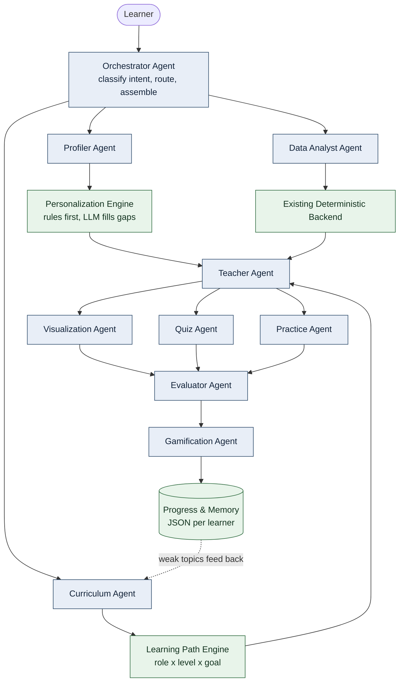
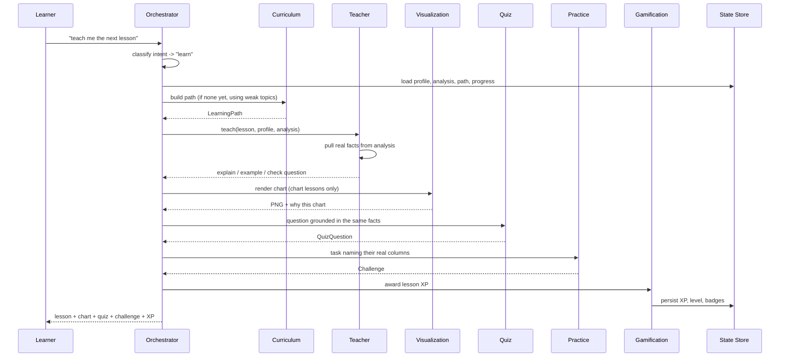
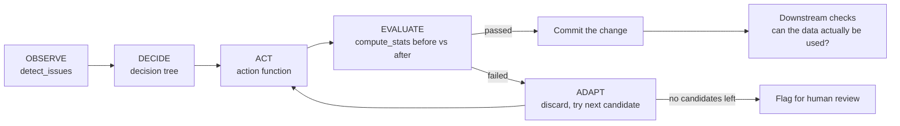
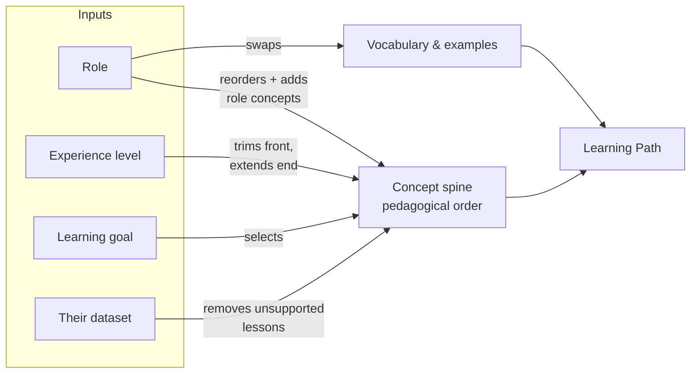
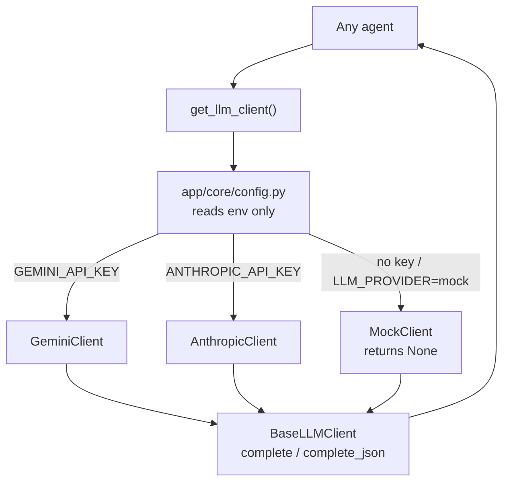

# Architecture

## The problem this shape solves

Non-data-science professionals do not need a data science degree. They need
the specific slice of it that applies to their job, their skill level, their
goal and their own file. That means two things have to be true at once:

1. What a learner is taught must be **decided from their profile and their
   data**, not from a fixed syllabus.
2. Every number they are shown must be **true of their actual file** -- which
   rules out letting a language model generate statistics.

The architecture follows directly from those two constraints. A deterministic
Python core computes all facts and decides all sequences; a language model,
when configured, rewords those facts. Nothing important depends on the model
being available.

---

## System overview



Green boxes are fully deterministic. Blue boxes are agents, each of which has
a deterministic path and an optional LLM path.

---

## The nine agents

Each agent has one responsibility, a typed input and a typed output. None of
them can do another's job -- the teacher never computes a statistic, the data
agent never writes a lesson, the evaluator never sets the task it marks.

| Agent | Responsibility | Input | Output |
|---|---|---|---|
| **Orchestrator** | Classify intent, route to specialists, assemble the reply | learner text, user_id | `OrchestratorResult` |
| **Profiler** | Extract a structured learner profile; say what is still unknown | free text + prior profile | `UserProfile` + onboarding questions |
| **Data Analyst** | All facts about the dataset | DataFrame, optional target | `DatasetAnalysis` |
| **Curriculum** | Decide what to learn and in what order | profile + analysis + weak topics | `LearningPath` |
| **Teacher** | Teach one concept: explain → example → check | lesson + profile + analysis | `TeachingBlock` |
| **Visualization** | Pick the right chart, justify it, render it | question + analysis + DataFrame | chart recommendation + PNG |
| **Quiz** | One grounded comprehension question; mark it | concept + profile + facts | `QuizQuestion` |
| **Practice** | Set a concrete task on their own columns | concept + profile + analysis | `Challenge` |
| **Gamification** | XP, levels, badges, streaks | user_id + event | XP/badge deltas |
| **Evaluator** | Score an answer, decide next difficulty, record weak/strong | challenge + answer | `EvaluationResult` |

---

## Request flow: one lesson



---

## The existing agentic loop, preserved

The original project's cleaning engine is the factual core of the Data Analyst
agent. It was not rewritten, wrapped in an LLM, or replaced:



Its behaviour on the demo dataset is a real adaptation, not a scripted one:

```
[issue] deal_value: missing_numeric (severity=medium)
  -> tried impute_median: FAILED (backtracking) -- skew shifted 21.3%
     (2.186 -> 2.651), exceeds 15.0% threshold -- distribution distorted
  -> tried impute_knn: PASSED -- skew shift 7.6%, within 15.0% threshold
```

A second, structurally identical loop runs for model selection: start simple,
measure, escalate only when a measurement gives a reason to.

Both loops feed the teaching layer. When a learner reaches the "missing values"
lesson, the example they are shown is the rejection above -- their own data,
their own numbers, an actual decision the system made and reversed.

---

## Personalization: how one system produces different courses



- The **goal** picks the concept spine -- `visualization` and `data_cleaning`
  are different sequences of different concepts.
- The **role** pulls its priority concepts forward and appends concepts the
  goal's default order omits (HR gets `attrition_analysis`, marketing gets
  `conversion_metrics`), and swaps the vocabulary so the same lesson reads as
  "one deal" for sales and "one record" for a data cleaner.
- The **experience level** trims: an advanced learner never sees
  `rows_and_columns`; a beginner never reaches `model_selection`.
- The **dataset** removes lessons it cannot demonstrate -- no date column means
  no line-chart lesson, because teaching it would require an invented example.

Same platform, same dataset, two opening sentences:

| | Sales / beginner / visualization | Data cleaner / beginner / cleaning |
|---|---|---|
| 1 | rows_and_columns | rows_and_columns |
| 2 | column_meanings | data_types |
| 3 | grouping | missing_values |
| 4 | bar_chart | duplicates |
| 5 | descriptive_stats | inconsistent_categories |
| 6 | line_chart | formatting_errors |
| 7 | histogram | outliers |
| 8 | chart_interpretation | business_translation |
| 9 | business_translation | — |

---

## Deterministic versus ML versus LLM

This split is the load-bearing design decision in the project.

| Layer | What it does | Kind |
|---|---|---|
| `detect_issues`, decision tree, action functions | Find and fix data problems | **Deterministic** |
| `compute_stats`, evaluation thresholds | Judge whether a fix worked | **Deterministic** |
| `downstream.py` | Verify the data is genuinely usable | **Deterministic** |
| `explore.py` | Distributions, outliers, correlations | **Deterministic (statistics)** |
| `charts.py` | Render real charts | **Deterministic** |
| `learning_path.py` | Decide the lesson sequence | **Deterministic** |
| `profile_extractor` rules | Extract role, level, goal from text | **Deterministic** |
| Quiz marking, challenge scoring | Score a learner | **Deterministic** |
| XP, levels, badges | Reward progress | **Deterministic** |
| `model_selector.py` | Train and choose a regression model | **ML (scikit-learn)** |
| `feature_importance.py` | Rank the columns that drove predictions | **ML (scikit-learn)** |
| `impute_knn` | Fill blanks from similar rows | **ML (scikit-learn)** |
| Teacher explanations | Reword computed facts warmly | **LLM (optional)** |
| Quiz/challenge wording | Fresher phrasing of the same facts | **LLM (optional)** |
| Profile gap-filling | Catch phrasings keywords miss | **LLM (optional)** |
| Intent classification fallback | Route an unmatched message | **LLM (optional)** |

Every LLM row is optional. Remove the API key and each falls back to a
deterministic path that produces the same structure with plainer wording.

### On "training an LLM"

**No language model is trained or fine-tuned in this project, and none needs to
be.** The system is a pretrained LLM used through system prompts, plus
specialized agents, plus the learner's profile, plus their dataset context,
plus persistent memory, plus deterministic Python tools. The personalization
comes from context and orchestration, not from model weights.

The machine learning that *is* real is scikit-learn: models are genuinely
trained on the learner's uploaded data, cross-validated, checked for
overfitting, and selected on measured evidence.

---

## LLM provider abstraction



- No agent imports a provider SDK or reads an environment variable.
- `complete()` returns `None` on any failure rather than raising, and every
  caller already has a fallback -- so a missing key, a rate limit and a
  malformed response all land in the same, already-tested code path.
- Adding a provider means one new class in `app/llm/llm_client.py`.
- Provider SDKs are imported lazily, so neither needs to be installed.

---

## Memory and progress

One JSON file per learner under `data/state/`, written atomically:

```json
{
  "profile":  { "role": "sales", "experience_level": "beginner", "...": "..." },
  "progress": {
    "xp": 110, "level": 2, "badges": ["Data Explorer", "First Steps"],
    "current_step": 3, "completed_lessons": [1, 2],
    "quiz_scores": [...], "challenge_scores": [...],
    "weak_topics": ["missing_values"], "strong_topics": ["bar_chart"],
    "streak_days": 1, "history": [...]
  },
  "learning_path": { "...": "..." },
  "dataset_analysis": { "...": "..." }
}
```

`weak_topics` closes the adaptive loop: the evaluator writes to it when an
answer falls short, and the curriculum agent reads it on the next path build
and moves those concepts to the front. `StateStore` is a small class with a
narrow interface, so replacing JSON with SQLite or Postgres means implementing
one class and changing nothing else.

---

## Directory layout

```
app/
├── main.py                  FastAPI backend (12 endpoints)
├── core/                    schemas.py, config.py, state.py
├── llm/                     base_client.py, llm_client.py, prompts.py
├── personalization/         user_profile.py, profile_extractor.py, learning_path.py
├── agents/                  the nine specialists + base.py
├── visualization/           charts.py
│
├── agent/                   ORIGINAL: detect.py, loop.py, issue.py
├── actions/                 ORIGINAL: cleaning strategies
├── eda/                     ORIGINAL: explore.py
├── evaluation/              ORIGINAL: stats.py, downstream.py
├── educator/                ORIGINAL: narration, lessons, quiz, code snippets
├── educator_anthropic_backup/  ORIGINAL: the Anthropic version of narration
├── gamification/            ORIGINAL: stateless XP/badge rules
└── modeling/                ORIGINAL: model_selector, column_roles, feature_importance
```

Everything below the divider is the original project, unmodified. The new
layers depend on it; it does not depend on them, so `run_full_demo.py` still
runs exactly as it did.
